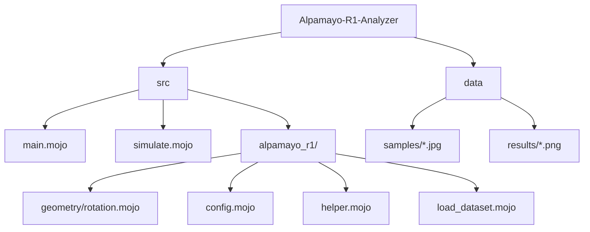
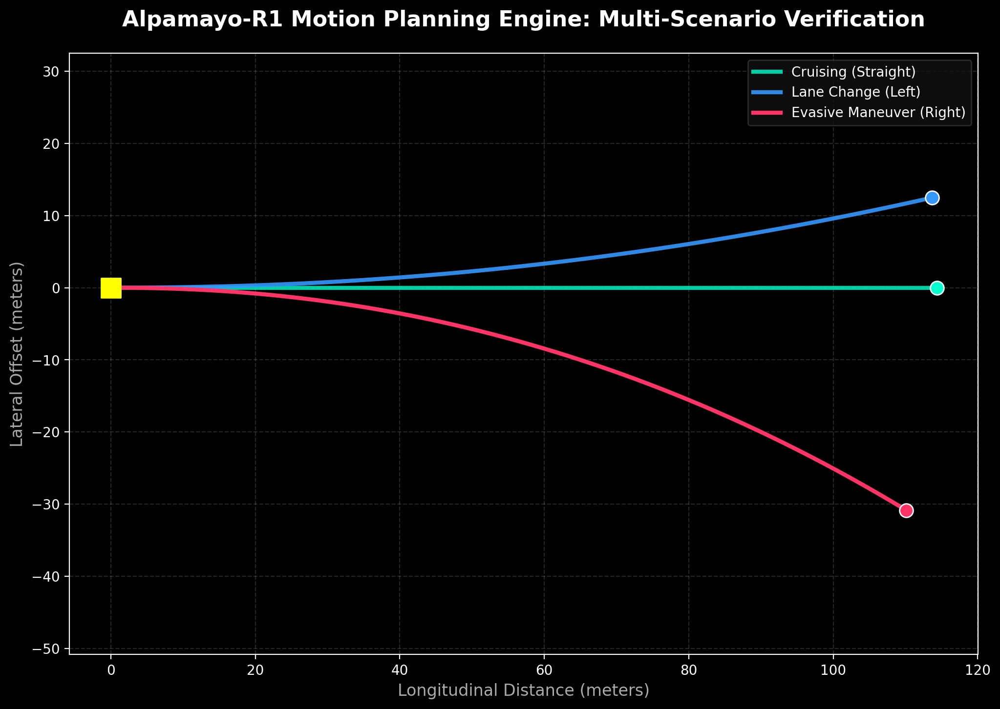

# Alpamayo-R1 Dashcam Analyzer

[](https://docs.modular.com/mojo/)
[](LICENSE)
[]()
[](https://github.com/ashishrai12/Dashcam-Image-Analysis-Alpamayo-R1/actions)

"Bridging the gap between linguistic reasoning and physical action for interpretable autonomous driving."

This project provides a high-performance Mojo implementation of NVIDIA's Alpamayo-R1 (AR1) vision-language-action (VLA) model. It integrates Chain-of-Causation (CoC) reasoning with precise trajectory planning, optimized for low-latency edge environments.

## Key Features

- **Mojo-Native Geometry Engine**: Spatial transformations and steering geometry logic rewritten in Mojo for near-zero overhead.
- **Interpretable AI**: Generates human-readable reasoning traces explaining why a driving decision was made.
- **High-Frequency Planning**: Capable of generating 64-point (6.4s) trajectories at 10Hz.
- **Python ML Interop**: Seamlessly leverages the existing PyTorch and Transformers ecosystem while running core logic at system-level speeds.

## Repository Structure



## Getting Started

### Prerequisites
- [Mojo SDK v24.x+](https://docs.modular.com/mojo/manual/get-started/)
- Python 3.12+ (managed via requirements.txt)
- NVIDIA GPU with 24GB+ VRAM (for full model inference)

### Installation

#### Option 1: Docker (Recommended)
Building with Docker ensures all system dependencies and the Mojo environment are correctly configured.

1. **Build the container**:
   ```bash
   docker build . -t alpamayo-r1 --build-arg MODULAR_AUTH_TOKEN=your_token_here
   ```

2. **Run the pipeline**:
   ```bash
   docker run -it --rm alpamayo-r1
   ```

#### Option 2: Local Installation
1. **Clone the repository**:
   ```bash
   git clone https://github.com/ashishrai12/Dashcam-Image-Analysis-Alpamayo-R1.git
   cd Dashcam-Image-Analysis-Alpamayo-R1
   ```

2. **Install Dependencies**:
   ```bash
   pip install -r requirements.txt
   ```

3. **Authenticate**:
   Request access to the [Alpamayo-R1-10B Model](https://huggingface.co/nvidia/Alpamayo-R1-10B) and login:
   ```bash
   huggingface-cli login
   ```

## Usage

### Run Inference
```bash
mojo src/main.mojo
```

### Run Multi-Scenario Simulation
Verify the motion planning engine across different driving maneuvers:
```bash
mojo src/simulate.mojo
```

## Visual Verification

Below is a visualization generated by the simulator, demonstrating the Mojo-native geometry engine's ability to plan physically plausible trajectories for straight cruising, lane changes, and evasive maneuvers.



## Continuous Integration

A GitHub Actions workflow is included in `.github/workflows/ci.yml`. It automatically:
1. Sets up the Mojo SDK environment.
2. Installs Python dependencies.
3. Executes the full unit test suite on every push.

### Running Tests Locally

```bash
# Execute Mojo unit tests
mojo src/test_mojo.mojo
```

## Technical Overview

- **Model Architecture**: Vision-Language-Action (VLA) based on Qwen3-VL-2B backbone.
- **Reasoning**: Structured CoC (Chain-of-Causation) to mitigate long-tail corner cases.
- **Action Decoder**: Diffusion-based flow matching for smooth, physically plausible waypoint generation.
- **Performance**: High-speed trajectory generation using Mojo's vectorized math operations.

## Contributing

We welcome contributions to further optimize the Mojo implementation!
1. Fork the Project
2. Create your Feature Branch (git checkout -b feature/AmazingFeature)
3. Commit your Changes (git commit -m 'Add AmazingFeature')
4. Push to the Branch (git push origin feature/AmazingFeature)
5. Open a Pull Request

## License

Distributed under the Apache 2.0 License. See LICENSE for more information.

## References

- [Alpamayo-R1 Paper](https://arxiv.org/abs/2511.00088)
- [NVIDIA Alpamayo-R1 Hugging Face](https://huggingface.co/nvidia/Alpamayo-R1-10B)
